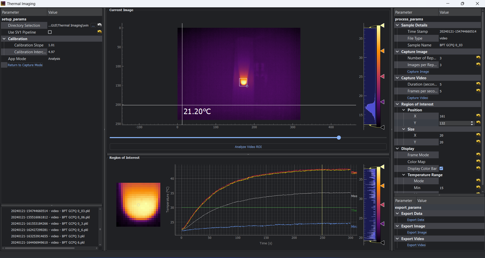

# Thermal Imaging



> Please contact me if you have any questions, or if you find any bugs.

## Description
This program is designed to capture and analyse thermal images from a Seek Thermal camera. It was developed as part of the [Raman Nano Thernaostics](https://rant-medicine.com/) project at University College London.

## Requirements
- Python (tested with anaconda, other installations may require additional packages)
- Python in the path (added either during anaconda installation or manually)
- Seek Thermal SDK (available [on request](https://developer.thermal.com/support/home)), installed in the default location  

```bash
C:/Program Files/Seek Thermal/Seek Thermal SDK/4.X.X/x64-windows/lib
```

- Find, right click on, and install the driver
```bash
C:/Program Files/Seek Thermal/Seek Thermal SDK/4.X.X/4-windows/driver/seekusb.inf
```

The `Use Thermocouple` feature has been tested with a [MCC USB-2001-TC](https://files.digilent.com/manuals/USB-2001-TC.pdf) data acquisition device, and is not guaranteed to work with other devices.
It requires the following additional installations:
1. Install the latest version of InstaCal from http://www.mccdaq.com/Software-Downloads.aspx
2. Install the the MCC UL Python API for Windows (mcculw) and any dependencies using pip:
```bash
pip install mcculw
```

## Installation

1. Navigate to the folder containing "Thermal Imaging.py" and "requirements.txt"  

    - Open the folder in explorer, type "cmd" or "powershell" in the address bar, then press enter.
    - Open the folder in explorer, hold shift and right click, then select "Open PowerShell window here"
    - Open cmd or PowerShell, then navigate to the folder using the "cd" command.

2. Use the package manager [pip](https://pip.pypa.io/en/stable/) to install requirements.
```bash
pip install -r requirements.txt
```

3. Run the program
```bash
python "Thermal Imaging.py"
```

## Usage
### Capture mode
1. If the camera is not automatically detected, click "Reload Camera"
2. If in Analysis mode, click "Return to Capture"
3. Set the data save location by clicking "Directory Selection"
4. Use the setting in the right panel to adjust the capture settings
5. Click "Capture Image" or "Capture Video"

### Calibration mode
1. Select the number of calibration points in the left panel under "Calibration Mode"
2. If "Use Thermocouple" is selected, and the device is setup correctly, the thermocouple temperature will be used as the calibration temperature. Therefore, the thermocouple should be placed in the field of view of the camera. Otherwise, the calibration temperature(s) can be set manually in the left panel.
3. Once the temperature wiithin the ROI has equilibriated, click "Set Point 1"
4. If using two calibration points, adjust the temperature, wait for equilibriation, and click "Set Point 2"

### Analysis mode
1. Click on a data file in the left panel to load it
2. ROI can be moved by clicking and dragging the box, or positioned accurately by entering the coordinates in the right panel.  
After moving the ROI, click "Analyse Video ROI" to update the analysis.
3. Frame Mode:
    - Individual frames: scoll through the frames using the slider in the center panel
    - Average frame: display the average of all raw frames
4. Temperature Range Mode:
    - Auto: the temperature range is automatically set to the minimum and maximum temperatures in the frame
    - Fixed: the temperature range is set to the temperature range set by the user in the right panel

### Exporting
1. Click "Export Data" in the right panel:
    - Generate a CSV file containing the raw frames
    - Generate a CSV file containing the average frame
    - Generate a CSV file containing the  ROI data
2. Click "Export Image" in the right panel:
    - Generate a PNG file containing individual frame or average frame based on the current mode
3. Click "Export Video" in the right panel:
    - Generate an AVI file containing raw frames

> Exporting may take some time, depending on the size of the data  

> Images and videos are exported based on the current settings
